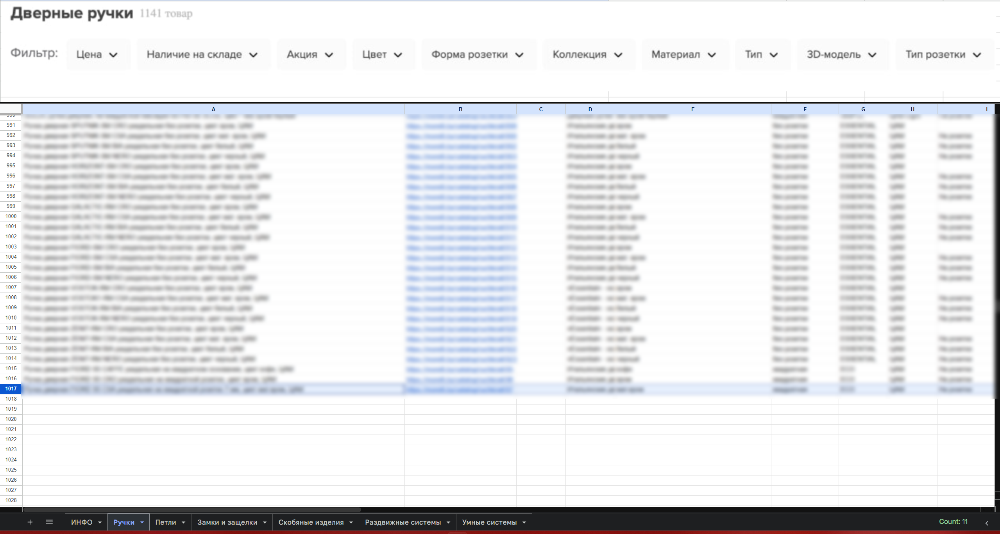
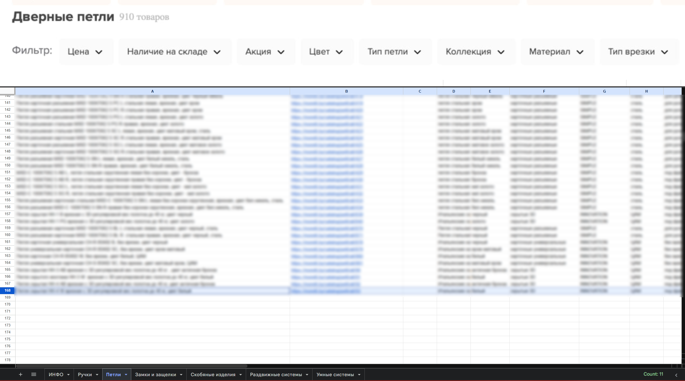

# ProductCatalogToSheets 🚀

**A commercial-grade asynchronous .NET solution for synchronizing e-commerce product catalogs with Google Sheets.**

## 💼 Business Context & Value
This project was developed as a custom solution for a commercial client for legitimate business purposes and was fully compensated. 
The project successfully migrated almost 2000 product entities in a single execution, ensuring 100% data integrity as shown in the screenshots below.

> **Note on Confidentiality:** To protect the client's privacy and proprietary business logic, the specific target website and production data are not disclosed in this repository. All identifying URLs and parameters have been replaced with placeholders.

The implementation of this tool provided significant business value by:
*   **Commercial Utility:** Automating the transition from manual data entry to a streamlined, automated synchronization pipeline.
*   **Operational Efficiency:** Reducing the time required for product catalog updates by approximately 90%.
*   **Data Reliability:** Ensuring high accuracy in pricing and inventory tracking for real-world business operations.

## 🚀 Features
- **Asynchronous Data Fetching**: Utilizes `HttpClient` and `HtmlAgilityPack` for efficient web scraping.
- **Google Sheets API Integration**: Direct synchronization of extracted data into cloud spreadsheets.
- **Flexible Configuration**: Proxy support, custom delays, and target URLs are managed via `appsettings.json`.
- **Error Handling**: Implements retry logic and request throttling to ensure stability and respect server limits.

## 📊 Results & Visualization

Below are screenshots demonstrating the successful migration of product data from the web catalog into a structured Google Sheets format. 






> **Note:** Sensitive commercial information in the screenshots has been obscured to maintain client confidentiality.

## 🛠️ Tech Stack
- **Language**: C# (.NET 10)
- **Libraries**: 
  - `HtmlAgilityPack` (HTML parsing)
  - `Google.Apis.Sheets.v4` (Cloud Integration)
  - `Microsoft.Extensions.Configuration` (Settings management)

## ⚠️ Ethical Usage & Disclaimer
**This project was developed for a specific commercial data migration task and is shared here for demonstration and portfolio purposes.** 
By using this tool, you agree that:
1. You will comply with the target website's `robots.txt` and Terms of Service.
2. You will not use this tool for aggressive scraping that could degrade server performance.
3. The author is not responsible for any misuse or legal consequences arising from the use of this software.

## ⚙️ Setup & Configuration
1. **Google Credentials**: Place your Google Service Account JSON key in the project folder.
2. **Configuration**: Create an `appsettings.json` file. Use the example below as a template (replace `example.com` with your authorized target).

```json
{
  "Proxy": {
    "Host": "your_proxy_host",
    "Username": "your_user",
    "Password": "your_password"
  },
  "GoogleSheets": {
    "CredentialPath": "credentials.json",
    "SpreadsheetId": "your_spreadsheet_id",
    "StartRow": "2"
  },
  "Scraper": {
    "BaseUrl": "https://example.com",
    "RequestDelayMs": 1000
  }
}
```

## ⚖️ License & Responsibility

This project is licensed under the **MIT License**. 

### What this means:
- **Permission**: You are free to use, copy, modify, and distribute this software for any purpose.
- **No Warranty**: The software is provided "as is", without warranty of any kind. The author is not liable for any claims, damages, or other liabilities.
- **Limitation of Liability**: The author is **not responsible** for how this tool is used. It is the user's sole responsibility to ensure that their web scraping activities:
    - Comply with the target website's `robots.txt` and Terms of Service.
    - Do not violate local laws (such as the Belarus Law on Personal Data Protection).
    - Do not disrupt the technical stability of the target servers.

See the [LICENSE](LICENSE) file for the full legal text.
